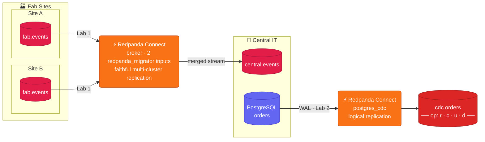

# Redpanda Connect Workshop
### Multi-Site Replication + CDC · 90 minutes

---

## Use Case

Texas Instruments runs Redpanda at each semiconductor fab to capture machine events, alarms, and process telemetry. Central IT needs a consolidated view across all sites — and wants to start streaming changes from their ERP database into that same hub.



**Lab 1** — You run a single Redpanda Connect pipeline that reads `fab.events` from two remote clusters simultaneously and merges them into `central.events` using the **Redpanda Migrator**, which replicates each record faithfully (key, headers, and timestamp preserved).

**Lab 2** — You run a separate pipeline that streams changes from a Postgres `orders` table directly into Redpanda using logical replication (no Debezium, no Kafka Connect).

---

## Agenda

| Time | Topic |
|------|-------|
| 0:00 – 0:10 | Setup: credentials, connectivity check |
| 0:10 – 0:55 | **Lab 1** — Fan-in replication (site-a + site-b → central) |
| 0:55 – 1:25 | **Lab 2** — Postgres CDC (orders → central) |
| 1:25 – 1:30 | Comparison: Connect CDC vs Debezium vs DMS |

---

## For Students

Everything you need is in this folder:

| File | What it is |
|------|-----------|
| `.env.example` | Credential template — copy to `.env` and fill in |
| `docker-compose.yaml` | Defines the **workbench** container that holds all the tools |
| `docker/Dockerfile` | Builds the workbench image (`rpk` + `redpanda-connect` + `psql`) |
| `lab-1-fan-in.md` | Step-by-step lab 1 |
| `lab-2-cdc.md` | Step-by-step lab 2 |
| `configs/fan-in.yaml` | Connect pipeline config for lab 1 |
| `configs/cdc.yaml` | Connect pipeline config for lab 2 |
| `redpanda.license` | Trial license, auto-mounted into the workbench (Lab 2 CDC) |
| `docker-compose.local.yaml` | Optional all-in-one **local** stack (3 clusters + Postgres + workbench) — run with no cloud account |
| `configs/fan-in.local.yaml`, `configs/cdc.local.yaml` | Plaintext lab configs for the local stack |

---

## Prerequisites

**The only thing you install is Docker.** Every tool the labs use — `rpk`,
`redpanda-connect`, and `psql` — runs inside a *workbench* container you build
in the next step. No local `rpk`, no local `redpanda-connect`, no local `psql`.

- Docker Desktop, or Docker Engine + the Compose plugin ([install guide](https://docs.docker.com/get-docker/))
- Cluster credentials from instructor (broker URL, username, password)
- Postgres credentials from instructor (Lab 2)

> **No cloud account / no instructor?** You can run the entire workshop on your
> own machine with zero credentials — skip ahead to
> [Run it locally](#run-it-locally-no-cloud-account).

Verify Docker is working before starting:
```bash
docker --version
docker compose version
```

---

## Setup (do this first)

Clone this repo and `cd` into it — **all commands assume you're at the repo root**:

```bash
git clone https://github.com/WesWWagner/redpanda-connect-workshop.git
cd redpanda-connect-workshop
```

Copy and fill in your credentials:

```bash
cp .env.example .env
# edit .env with the values from your instructor
```

Build the workbench container (one-time, a few minutes) and start it:

```bash
docker compose build workbench
docker compose up -d workbench
```

Open a shell inside the workbench. **Every command in both labs runs from inside this shell:**

```bash
docker compose exec workbench bash
```

You're now in `/workshop` with `rpk`, `redpanda-connect`, and `psql` on the
PATH and your `.env` values already loaded as environment variables — so
`$SITE_A_BROKER`, `$PG_HOST`, and the rest just work, with no `source .env`
needed. Confirm the tools are present:

```bash
rpk version
redpanda-connect --version
psql --version
```

> **Need a second terminal later?** (Lab 1 asks for a few.) Just run
> `docker compose exec workbench bash` again in the new terminal — your `.env`
> values are already loaded there too.

Verify all three clusters are reachable (still inside the workbench shell):

```bash
rpk cluster info --brokers $SITE_A_BROKER --tls-enabled --sasl-mechanism SCRAM-SHA-256 --sasl-username $SITE_A_USER --sasl-password $SITE_A_PASSWORD
rpk cluster info --brokers $SITE_B_BROKER --tls-enabled --sasl-mechanism SCRAM-SHA-256 --sasl-username $SITE_B_USER --sasl-password $SITE_B_PASSWORD
rpk cluster info --brokers $CENTRAL_BROKER --tls-enabled --sasl-mechanism SCRAM-SHA-256 --sasl-username $CENTRAL_USER --sasl-password $CENTRAL_PASSWORD
```

**Expected output (each):**
```
CLUSTER
=======
redpanda.xxxxx

BROKERS
=======
ID    HOST                         PORT
0*    seed-xxxxx.xxx.fmc.prd.cloud  9092
```

If all three respond, you're ready. → [Start Lab 1](lab-1-fan-in.md)

---

## When you're done

Leave the workbench shell with `exit`, then stop the container:

```bash
docker compose down
```

---

## Run it locally (no cloud account)

No instructor clusters? `docker-compose.local.yaml` runs the whole workshop on
your machine: three single-node Redpanda clusters (site-a, site-b, central), a
Postgres for Lab 2, and the workbench — all on one Docker network, plaintext, no
credentials. The bundled trial license is mounted automatically, so Lab 2's CDC
works too.

Bring it up (the first run builds the workbench image) and open a shell:

```bash
docker compose -f docker-compose.local.yaml up -d
docker compose -f docker-compose.local.yaml exec workbench bash
```

The workbench already has the local connection details as environment variables:
`$SITE_A_BROKER=redpanda-site-a:9092`, `$SITE_B_BROKER=redpanda-site-b:9092`,
`$CENTRAL_BROKER=redpanda-central:9092`, and `$PG_HOST=postgres`.

**Lab 1 (fan-in)** — the cloud commands minus `--tls-enabled`/`--sasl-*`, using
the local config `configs/fan-in.local.yaml`:

```bash
rpk topic create fab.events --partitions 3 --brokers $SITE_A_BROKER
rpk topic create fab.events --partitions 3 --brokers $SITE_B_BROKER
rpk topic create central.events --partitions 6 --brokers $CENTRAL_BROKER

# leave this running; open another workbench shell for the produce/consume steps
redpanda-connect run configs/fan-in.local.yaml
```

```bash
for i in $(seq 1 5); do echo "{\"site\":\"a\",\"seq\":$i}"; done | rpk topic produce fab.events --brokers $SITE_A_BROKER
for i in $(seq 1 5); do echo "{\"site\":\"b\",\"seq\":$i}"; done | rpk topic produce fab.events --brokers $SITE_B_BROKER

rpk topic consume central.events --offset start --brokers $CENTRAL_BROKER   # Ctrl+C when done
```

All ten messages land in `central.events`, each still carrying its `site` field.

**Lab 2 (CDC)** — use `configs/cdc.local.yaml` (plaintext DSN + the bundled license):

```bash
rpk topic create cdc.orders --partitions 3 --brokers $CENTRAL_BROKER
redpanda-connect run configs/cdc.local.yaml       # snapshot of orders, then live changes
```

In another shell, drive changes and watch them arrive (the config's DSN already
points at `$PG_HOST`):

```bash
psql "postgres://$PG_USER:$PG_PASSWORD@$PG_HOST:$PG_PORT/$PG_DB?sslmode=disable" \
  -c "INSERT INTO public.orders (item, qty, status) VALUES ('sensor', 100, 'pending');"
rpk topic consume cdc.orders --offset start --brokers $CENTRAL_BROKER   # Ctrl+C when done
```

Each event is a flat row, e.g. `{"_captured_at":"…","id":1,"item":"widget","qty":5,"status":"pending"}`.

Tear it all down (removes local data):

```bash
docker compose -f docker-compose.local.yaml down -v
```
