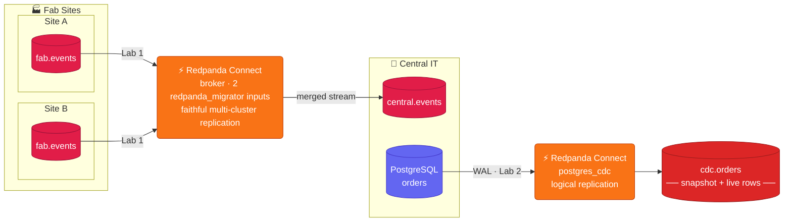

# Redpanda Connect Workshop
### Multi-Site Replication + CDC · runs entirely on your laptop · ~90 minutes

---

## Use Case

Texas Instruments runs Redpanda at each semiconductor fab to capture machine events, alarms, and process telemetry. Central IT needs a consolidated view across all sites — and wants to start streaming changes from their ERP database into that same hub.



**Lab 1** — A single Redpanda Connect pipeline reads `fab.events` from the two fab clusters at once and merges them into `central.events` using the **Redpanda Migrator**, which replicates each record faithfully (key, headers, and timestamp preserved).

**Lab 2** — A separate pipeline streams changes from a Postgres `orders` table directly into Redpanda using logical replication (no Debezium, no Kafka Connect).

> **This workshop is fully local and Docker-only.** One `docker compose up` brings
> up the whole thing — the two fab clusters, the central cluster, Postgres, and a
> *workbench* container with all the tooling — on your machine. No cloud account,
> no credentials, nothing to install but Docker.

---

## Agenda

| Time | Topic |
|------|-------|
| 0:00 – 0:10 | Setup: bring up the stack, open the workbench |
| 0:10 – 0:55 | **Lab 1** — Fan-in replication (site-a + site-b → central) |
| 0:55 – 1:25 | **Lab 2** — Postgres CDC (orders → central) |
| 1:25 – 1:30 | Comparison: Connect CDC vs Debezium vs DMS |

---

## What's in the repo

| File | What it is |
|------|-----------|
| `docker-compose.yaml` | The whole environment: two fab clusters + central + Postgres + workbench |
| `docker/Dockerfile` | Builds the workbench image (`rpk` + `redpanda-connect` + `psql`) |
| `lab-1-fan-in.md` | Step-by-step Lab 1 |
| `lab-2-cdc.md` | Step-by-step Lab 2 |
| `configs/fan-in.yaml` | Connect pipeline for Lab 1 |
| `configs/cdc.yaml` | Connect pipeline for Lab 2 |
| `redpanda.license` | Trial license, auto-mounted into the workbench (Lab 2's CDC needs it) |
| `solution/` | Instructor-only — automated lab checks. Students can ignore it. |

---

## Prerequisites

**The only thing you install is Docker.** Every tool the labs use — `rpk`,
`redpanda-connect`, and `psql` — runs inside the *workbench* container that
`docker compose` builds for you.

- Docker Desktop, or Docker Engine + the Compose plugin ([install guide](https://docs.docker.com/get-docker/))

Verify Docker is working:
```bash
docker --version
docker compose version
```

---

## Setup (do this first)

Clone this repo and `cd` into it — **all commands assume you're at the repo root**:

```bash
git clone https://github.com/WesWWagner/redpanda-connect-workshop.git
cd redpanda-connect-workshop
```

Bring up the whole stack. The first run builds the workbench image (a few
minutes); after that it's seconds:

```bash
docker compose up -d
```

Compose waits for the clusters' healthchecks, so when it returns you're ready.
You can always confirm with `docker compose ps` — every service should show
`(healthy)`.

Open a shell inside the workbench. **Every lab command runs from inside this shell:**

```bash
docker compose exec workbench bash
```

You're now in `/workshop` with `rpk`, `redpanda-connect`, and `psql` on the PATH,
and the connection details preloaded as environment variables — so the labs'
`$SITE_A_BROKER`, `$CENTRAL_BROKER`, `$PG_HOST`, etc. just work:

| Variable | Value |
|----------|-------|
| `$SITE_A_BROKER` | `redpanda-site-a:9092` |
| `$SITE_B_BROKER` | `redpanda-site-b:9092` |
| `$CENTRAL_BROKER` | `redpanda-central:9092` |
| `$PG_HOST` (+ `$PG_PORT` `$PG_USER` `$PG_PASSWORD` `$PG_DB`) | `postgres` |
| `$STUDENT_ID` | `local` — names your consumer group (`fan-in-local`) and CDC slot (`rpcn_cdc_local`) |

Confirm the tools are present:
```bash
rpk version
redpanda-connect --version
psql --version
```

> `rpk version` may print a `Redpanda Cluster Unreachable` line beneath the
> version — harmless here (it's just probing a default broker), not an error.

> **Need a second terminal during a lab?** (Lab 1 asks for a couple.) Just run
> `docker compose exec workbench bash` again in the new terminal — the same env
> vars are already loaded there.

You're ready. → [Start Lab 1](lab-1-fan-in.md)

---

## When you're done

Leave the workbench shell with `exit`, then tear everything down (this removes
all local data — topics, Postgres, and the CDC slot):

```bash
docker compose down -v
```

> **Keeping the stack up to re-run a lab instead of `down -v`?** Re-run each
> lab's **Cleanup** section first — in particular, drop the CDC replication slot,
> or Lab 2's next run will skip its snapshot.
