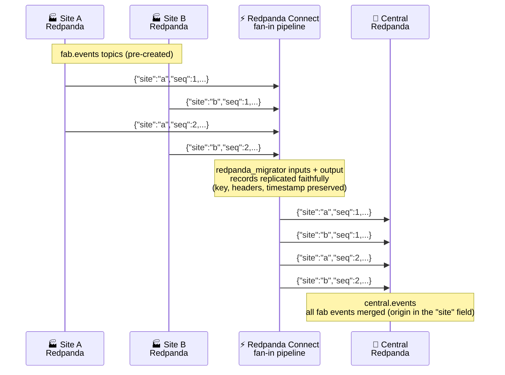

# Lab 1: Fan-In Replication

**Duration:** ~45 minutes  
**Level:** Intermediate

## What you'll do
- Create `fab.events` on site-a and site-b
- Create `central.events` on central
- Run a Connect pipeline that merges both into central
- Produce test messages and verify fan-in



---

> **Run everything in this lab inside the workbench shell** — open it with
> `docker compose exec workbench bash` (see the [README setup](README.md#setup-do-this-first)).
> Your `.env` values are already loaded there, so `$SITE_A_BROKER` and friends
> just work. The `source .env` steps below are optional and harmless — keep or skip them.

## Part 1: Create topics

```bash
source .env
```

**Site A:**
```bash
rpk topic create fab.events --partitions 3 \
  --brokers $SITE_A_BROKER --tls-enabled \
  --sasl-mechanism SCRAM-SHA-256 \
  --sasl-username $SITE_A_USER --sasl-password $SITE_A_PASSWORD
```

**Expected output:**
```
TOPIC       STATUS
fab.events  OK
```

**Site B** (same command, different broker):
```bash
rpk topic create fab.events --partitions 3 \
  --brokers $SITE_B_BROKER --tls-enabled \
  --sasl-mechanism SCRAM-SHA-256 \
  --sasl-username $SITE_B_USER --sasl-password $SITE_B_PASSWORD
```

**Central:**
```bash
rpk topic create central.events --partitions 6 \
  --brokers $CENTRAL_BROKER --tls-enabled \
  --sasl-mechanism SCRAM-SHA-256 \
  --sasl-username $CENTRAL_USER --sasl-password $CENTRAL_PASSWORD
```

---

## Part 2: Produce test messages

Open two workbench shells (run `docker compose exec workbench bash` in two separate terminals). In each, run one of the following.

**Terminal 1 — Site A:**
```bash
source .env
for i in $(seq 1 5); do
  echo "{\"site\":\"a\",\"seq\":$i,\"ts\":$(date +%s)}"
done | rpk topic produce fab.events \
  --brokers $SITE_A_BROKER --tls-enabled \
  --sasl-mechanism SCRAM-SHA-256 \
  --sasl-username $SITE_A_USER --sasl-password $SITE_A_PASSWORD
```

**Expected output:**
```
Produced to partition 0 at offset 0 with timestamp ...
Produced to partition 1 at offset 0 with timestamp ...
...
```

**Terminal 2 — Site B** (open a second workbench shell: `docker compose exec workbench bash` — your `.env` is already loaded there):
```bash
source .env
for i in $(seq 1 5); do
  echo "{\"site\":\"b\",\"seq\":$i,\"ts\":$(date +%s)}"
done | rpk topic produce fab.events \
  --brokers $SITE_B_BROKER --tls-enabled \
  --sasl-mechanism SCRAM-SHA-256 \
  --sasl-username $SITE_B_USER --sasl-password $SITE_B_PASSWORD
```

---

## Part 3: Configure the pipeline

Open `configs/fan-in.yaml`. It's already written — review it before running.

Key things to notice:
- `broker` input combines two `redpanda_migrator` sources — one per fab cluster
- The Redpanda Migrator replicates each record faithfully (key, headers, timestamp) — no custom mapping needed
- Single `redpanda_migrator` output writes the merged stream to central; each record keeps its own `site` field

Validate it:
```bash
redpanda-connect lint configs/fan-in.yaml
```

**Expected output:**
```
configs/fan-in.yaml [0 errors]
```

---

## Part 4: Run the pipeline

```bash
source .env
redpanda-connect run --env-file .env configs/fan-in.yaml
```

**Expected output (first few seconds):**
```
level=info msg="Launching a Redpanda Connect instance, use CTRL+C to close"
level=info msg="Output type redpanda_migrator is now active" path=root.output
level=info msg="Input type redpanda_migrator is now active" path=root.input.broker.inputs.0
level=info msg="Input type redpanda_migrator is now active" path=root.input.broker.inputs.1
```

Let it run. Messages from both sites are flowing to central.

> Leave this pipeline running. For the next step, open **another** workbench shell (`docker compose exec workbench bash` in a new terminal) — your `.env` is already loaded there.

---

## Part 5: Verify at central

```bash
source .env
rpk topic consume central.events --offset start \
  --brokers $CENTRAL_BROKER --tls-enabled \
  --sasl-mechanism SCRAM-SHA-256 \
  --sasl-username $CENTRAL_USER --sasl-password $CENTRAL_PASSWORD
```

> This streams continuously. Press `Ctrl+C` once you've seen enough messages.

**Expected output:**
```json
{"site":"a","seq":1,"ts":1720000001}
{"site":"b","seq":1,"ts":1720000002}
{"site":"a","seq":2,"ts":1720000003}
...
```

You should see messages from **both** site-a and site-b, replicated verbatim — the
`site` field tells you which fab each came from. Order may vary — that's expected.

---

## Part 6: Produce more messages (live)

With the pipeline still running, produce 5 more messages to site-a (in the terminal where you ran Part 2, or any terminal with `source .env`):

```bash
source .env
for i in $(seq 6 10); do
  echo "{\"site\":\"a\",\"seq\":$i,\"ts\":$(date +%s)}"
done | rpk topic produce fab.events \
  --brokers $SITE_A_BROKER --tls-enabled \
  --sasl-mechanism SCRAM-SHA-256 \
  --sasl-username $SITE_A_USER --sasl-password $SITE_A_PASSWORD
```

Then consume from central again. New messages appear within seconds.

---

## Cleanup

Stop the pipeline: `Ctrl+C`

```bash
source .env

rpk topic delete fab.events \
  --brokers $SITE_A_BROKER --tls-enabled \
  --sasl-mechanism SCRAM-SHA-256 \
  --sasl-username $SITE_A_USER --sasl-password $SITE_A_PASSWORD

rpk topic delete fab.events \
  --brokers $SITE_B_BROKER --tls-enabled \
  --sasl-mechanism SCRAM-SHA-256 \
  --sasl-username $SITE_B_USER --sasl-password $SITE_B_PASSWORD

rpk topic delete central.events \
  --brokers $CENTRAL_BROKER --tls-enabled \
  --sasl-mechanism SCRAM-SHA-256 \
  --sasl-username $CENTRAL_USER --sasl-password $CENTRAL_PASSWORD

rpk group delete fan-in-$STUDENT_ID \
  --brokers $SITE_A_BROKER --tls-enabled \
  --sasl-mechanism SCRAM-SHA-256 \
  --sasl-username $SITE_A_USER --sasl-password $SITE_A_PASSWORD

rpk group delete fan-in-$STUDENT_ID \
  --brokers $SITE_B_BROKER --tls-enabled \
  --sasl-mechanism SCRAM-SHA-256 \
  --sasl-username $SITE_B_USER --sasl-password $SITE_B_PASSWORD
```

---

## What you learned
- A single Connect pipeline can consume from multiple Redpanda clusters simultaneously
- The `redpanda_migrator` components replicate records faithfully — keys, headers, and timestamps preserved — with no custom mapping
- A `broker` input fans several migrator sources into one output
- Consumer groups are namespaced per student (`fan-in-$STUDENT_ID`) so runs don't interfere
- Messages from multiple sources land in one topic at central, each still carrying its `site` field

→ [Start Lab 2](lab-2-cdc.md)
