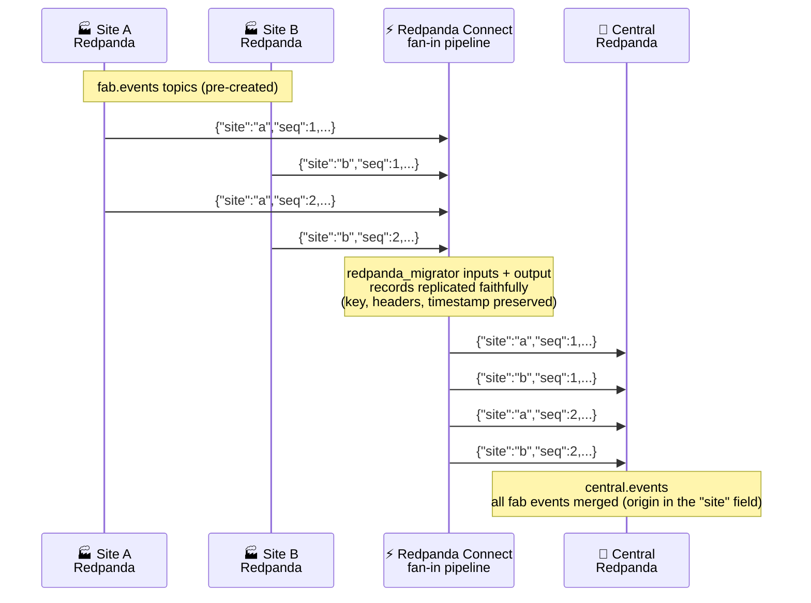

# Lab 1: Fan-In Replication

**Duration:** ~45 minutes  
**Level:** Intermediate

## What you'll do
- Create `fab.events` on site-a and site-b
- Create `central.events` on central
- Run a Connect pipeline that merges both into central
- Produce test messages and verify fan-in



---

> **Run everything in this lab inside the workbench shell** — open it with
> `docker compose exec workbench bash` (see the [README setup](README.md#setup-do-this-first)).
> The broker addresses are already loaded as environment variables there, so
> `$SITE_A_BROKER`, `$SITE_B_BROKER`, and `$CENTRAL_BROKER` just work.

## Part 1: Create topics

```bash
rpk topic create fab.events --partitions 3 --brokers $SITE_A_BROKER
rpk topic create fab.events --partitions 3 --brokers $SITE_B_BROKER
rpk topic create central.events --partitions 6 --brokers $CENTRAL_BROKER
```

**Expected output** (one block per command):
```
TOPIC       STATUS
fab.events  OK
```

---

## Part 2: Produce test messages

Open two workbench shells (run `docker compose exec workbench bash` in two separate terminals). In each, run one of the following.

**Terminal 1 — Site A:**
```bash
for i in $(seq 1 5); do
  echo "{\"site\":\"a\",\"seq\":$i,\"ts\":$(date +%s)}"
done | rpk topic produce fab.events --brokers $SITE_A_BROKER
```

**Expected output** (partition/offset numbers will vary):
```
Produced to partition 2 at offset 0 with timestamp ...
Produced to partition 2 at offset 1 with timestamp ...
...
```

**Terminal 2 — Site B:**
```bash
for i in $(seq 1 5); do
  echo "{\"site\":\"b\",\"seq\":$i,\"ts\":$(date +%s)}"
done | rpk topic produce fab.events --brokers $SITE_B_BROKER
```

---

## Part 3: Review the pipeline

Open `configs/fan-in.yaml`. It's already written — review it before running.

Key things to notice:
- `broker` input combines two `redpanda_migrator` sources — one per fab cluster
- The Redpanda Migrator replicates each record faithfully (key, headers, timestamp) — no custom mapping needed
- Single `redpanda_migrator` output writes the merged stream to central; each record keeps its own `site` field

Validate it:
```bash
redpanda-connect lint configs/fan-in.yaml
```

A clean lint prints **nothing** and exits `0` — silence means success.

---

## Part 4: Run the pipeline

```bash
redpanda-connect run configs/fan-in.yaml
```

**Expected output (first few seconds — line order may vary):**
```
level=info msg="Launching a Redpanda Connect instance, use CTRL+C to close"
level=info msg="Output type redpanda_migrator is now active" path=root.output
level=info msg="Input type redpanda_migrator is now active" path=root.input.broker.inputs.0
level=info msg="Input type redpanda_migrator is now active" path=root.input.broker.inputs.1
```

Let it run — messages from both sites are now flowing to central.

> The Migrator also logs lines like `Schema migration: schema registry sync
> disabled` and `Topic migration: starting topic sync loop every 5m0s`. That's
> expected and harmless — this lab replicates data only.

> Leave this pipeline running. For the next step, open **another** workbench shell (`docker compose exec workbench bash` in a new terminal).

---

## Part 5: Verify at central

```bash
rpk topic consume central.events --offset start -f '%v\n' --brokers $CENTRAL_BROKER
```

> This streams continuously. Press `Ctrl+C` once you've seen enough messages.
> `-f '%v\n'` prints just the message value (what's shown below). Drop it to see
> the full record — key, headers, partition/offset — where the
> `redpanda-migrator-provenance` header and preserved timestamp show the Migrator
> replicated everything, not just the payload.

**Expected output:**
```json
{"site":"a","seq":1,"ts":1720000001}
{"site":"b","seq":1,"ts":1720000002}
{"site":"a","seq":2,"ts":1720000003}
...
```

You should see messages from **both** site-a and site-b, replicated verbatim — the
`site` field tells you which fab each came from. Order may vary — that's expected.

---

## Part 6: Produce more messages (live)

With the pipeline still running, produce 5 more messages to site-a (in any workbench shell):

```bash
for i in $(seq 6 10); do
  echo "{\"site\":\"a\",\"seq\":$i,\"ts\":$(date +%s)}"
done | rpk topic produce fab.events --brokers $SITE_A_BROKER
```

Then consume from central again. New messages appear within seconds.

---

## Cleanup

Stop the pipeline: `Ctrl+C`

```bash
rpk topic delete fab.events --brokers $SITE_A_BROKER
rpk topic delete fab.events --brokers $SITE_B_BROKER
rpk topic delete central.events --brokers $CENTRAL_BROKER

rpk group delete fan-in-$STUDENT_ID --brokers $SITE_A_BROKER
rpk group delete fan-in-$STUDENT_ID --brokers $SITE_B_BROKER
```

> Stop the pipeline **before** deleting the group, so the group is idle. For up
> to a minute after stopping it the group can report `NON_EMPTY_GROUP` while the
> consumer session times out — just wait and retry. And if a `group delete` says
> the group doesn't exist, it was already cleaned up — safe to ignore.

---

## What you learned
- A single Connect pipeline can consume from multiple Redpanda clusters simultaneously
- The `redpanda_migrator` components replicate records faithfully — keys, headers, and timestamps preserved — with no custom mapping
- A `broker` input fans several migrator sources into one output
- Consumer groups are namespaced (`fan-in-$STUDENT_ID`) so parallel runs don't interfere
- Messages from multiple sources land in one topic at central, each still carrying its `site` field

→ [Start Lab 2](lab-2-cdc.md)
