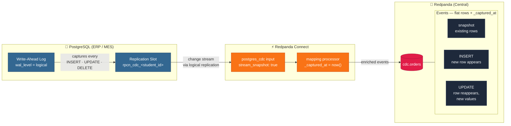

# Lab 2: PostgreSQL CDC

**Duration:** ~35 minutes  
**Level:** Intermediate

## What you'll do
- Connect to a pre-provisioned Postgres database
- Stream changes from `public.orders` into `cdc.orders` on the central cluster
- Insert and update rows to see CDC events in real time
- Compare this approach against Debezium and AWS DMS



---

> **Run everything in this lab inside the workbench shell** — open it with
> `docker compose exec workbench bash` (see the [README setup](README.md#setup-do-this-first)).
> Your credentials are already loaded as environment variables, so `$PG_HOST`,
> `$CENTRAL_BROKER`, and the rest just work — no `source .env` needed.
>
> **No cloud account?** Run this lab against the local stack — see
> [Run it locally](README.md#run-it-locally-no-cloud-account). Open the workbench
> with `docker compose -f docker-compose.local.yaml exec workbench bash` (keep
> **`-f docker-compose.local.yaml` on every compose command**). Then the steps
> are the same, except you use `configs/cdc.local.yaml` and drop
> `--tls-enabled`/`--sasl-*`.

## Part 1: Verify Postgres access

```bash
psql "postgresql://${PG_USER}:${PG_PASSWORD}@${PG_HOST}:${PG_PORT}/${PG_DB}" \
  -c "SELECT count(*) FROM public.orders;"
```

**Expected output:**
```
 count
-------
    10
(1 row)
```

Check that logical replication is enabled:

```bash
psql "postgresql://${PG_USER}:${PG_PASSWORD}@${PG_HOST}:${PG_PORT}/${PG_DB}" \
  -c "SHOW wal_level;"
```

**Expected output:**
```
 wal_level
-----------
 logical
(1 row)
```

> If `wal_level` is not `logical`, tell the instructor — the database needs to be reconfigured.

---

## Part 2: Create the output topic

```bash
rpk topic create cdc.orders --partitions 3 \
  --brokers $CENTRAL_BROKER --tls-enabled \
  --sasl-mechanism SCRAM-SHA-256 \
  --sasl-username $CENTRAL_USER --sasl-password $CENTRAL_PASSWORD
```

**Expected output:**
```
TOPIC       STATUS
cdc.orders  OK
```

---

## Part 3: Review the CDC pipeline

Open `configs/cdc.yaml`. Key things to notice:

- `postgres_cdc` input uses a **replication slot** — Postgres durably tracks what we've consumed
- `stream_snapshot: true` means we'll get all existing rows first, then live changes
- `slot_name` includes `$STUDENT_ID` so each student has an isolated slot
- Output is `kafka_franz` to your central cluster

> **`postgres_cdc` is a Redpanda Enterprise feature — and the license is
> already wired up for you.** A short-lived trial license ships in this repo as
> `redpanda.license`, and the workbench mounts it at Connect's default license
> path, so `redpanda-connect run` picks it up automatically. Nothing to do.
>
> If the trial has expired you'll see *"this feature requires a valid Redpanda
> Enterprise Edition license"* — just drop a fresh `redpanda.license` into the
> `workshop/` folder (or set `REDPANDA_LICENSE=<key>` in `.env`) and re-run.

Validate:
```bash
redpanda-connect lint configs/cdc.yaml
```

A clean lint prints **nothing** and exits `0` — silence means success. (If you
see `required environment variables were not set`, your `.env` isn't filled in,
or you're running outside the workbench shell where those variables are loaded.)

---

## Part 4: Run the pipeline

```bash
redpanda-connect run configs/cdc.yaml
```

**Expected output (initial snapshot):**
```
level=info msg="Launching a Redpanda Connect instance, use CTRL+C to close"
level=info msg="Input type postgres_cdc is now active" path=root.input
level=info msg="Output type kafka_franz is now active" path=root.output
```
Messages start flowing immediately — the snapshot rows arrive first, then live changes.

> **The snapshot only happens the first time the slot is created.** If you re-run
> after a previous run, the existing slot means the snapshot is skipped and you'll
> only see *new* changes. To replay the snapshot, drop the slot first (see
> [Cleanup](#cleanup)).

---

## Part 5: Consume the snapshot

Open a new terminal (another workbench shell). Stream from the beginning — the first ~10 messages are the snapshot rows:

```bash
rpk topic consume cdc.orders --offset start \
  --brokers $CENTRAL_BROKER --tls-enabled \
  --sasl-mechanism SCRAM-SHA-256 \
  --sasl-username $CENTRAL_USER --sasl-password $CENTRAL_PASSWORD
```

> Streams continuously. Press `Ctrl+C` once you've seen ~10 snapshot rows.

**Expected output:**
```json
{"_captured_at":"2026-01-01T00:00:00Z","id":1,"item":"widget","qty":5,"status":"pending"}
{"_captured_at":"2026-01-01T00:00:00Z","id":2,"item":"gadget","qty":3,"status":"shipped"}
...
```

Each event is the **full row** plus the `_captured_at` timestamp your pipeline
added. The snapshot streams every existing row first (ids 1–10), then the
pipeline switches to live changes.

---

## Part 6: Trigger live changes

Insert a new order:

```bash
psql "postgresql://${PG_USER}:${PG_PASSWORD}@${PG_HOST}:${PG_PORT}/${PG_DB}" \
  -c "INSERT INTO public.orders (item, qty, status) VALUES ('sensor', 100, 'pending');"
```

**Expected output:**
```
INSERT 0 1
```

Now update an existing order:

```bash
psql "postgresql://${PG_USER}:${PG_PASSWORD}@${PG_HOST}:${PG_PORT}/${PG_DB}" \
  -c "UPDATE public.orders SET status = 'shipped' WHERE id = 1;"
```

The pipeline picks up changes in real time. Watch the consume you started in Part 5 — new messages appear within a second. If you stopped it, re-run:

```bash
rpk topic consume cdc.orders --offset start \
  --brokers $CENTRAL_BROKER --tls-enabled \
  --sasl-mechanism SCRAM-SHA-256 \
  --sasl-username $CENTRAL_USER --sasl-password $CENTRAL_PASSWORD
```

Press `Ctrl+C` once you see the new rows for the INSERT and the UPDATE:

```json
{"_captured_at":"2026-01-01T00:05:00Z","id":11,"item":"sensor","qty":100,"status":"pending"}
{"_captured_at":"2026-01-01T00:05:01Z","id":1,"item":"widget","qty":5,"status":"shipped"}
```

The INSERT shows up as a brand-new row (a new `id` — the exact value depends on
the table's sequence). The UPDATE shows the **same** `id: 1` reappearing with
`status` now `"shipped"`. Note there is no `op`/`before`/`after` envelope — each
event is just the current row plus `_captured_at`; you tell inserts from updates
by whether the `id` is new or a repeat.

---

## Cleanup

Stop the pipeline: `Ctrl+C`

Drop the replication slot (important — slots hold Postgres WAL disk space, and a
leftover slot makes the next run skip its snapshot):

```bash
psql "postgresql://${PG_USER}:${PG_PASSWORD}@${PG_HOST}:${PG_PORT}/${PG_DB}" \
  -c "SELECT pg_drop_replication_slot('rpcn_cdc_${STUDENT_ID}');"
```

Delete the topic:

```bash
rpk topic delete cdc.orders \
  --brokers $CENTRAL_BROKER --tls-enabled \
  --sasl-mechanism SCRAM-SHA-256 \
  --sasl-username $CENTRAL_USER --sasl-password $CENTRAL_PASSWORD
```

---

## What you learned
- Redpanda Connect can stream Postgres WAL directly — no Kafka Connect, no JVM
- Initial snapshot + live changes in a single pipeline
- Each event is the full row enriched with `_captured_at` (no Debezium-style `op`/`before`/`after` envelope)
- Replication slots guarantee no changes are missed across restarts — but a stale slot skips the snapshot, so drop it between fresh runs
- Each student needs a unique slot name — shared slots cause conflicts

---

## CDC Approach Comparison

| | **Redpanda Connect** | **Debezium** | **AWS DMS** |
|---|---|---|---|
| **Setup** | Single YAML, one binary | Kafka Connect cluster + connector config | Console wizard, managed |
| **JVM required** | No | Yes | No |
| **Schema evolution** | Manual (Bloblang) | Schema Registry integration | Limited |
| **Transforms** | Bloblang (full scripting) | SMTs (limited) | Table mappings |
| **Cost** | Included with Redpanda | Free OSS, ops overhead | Per-DBU billing |
| **Best for** | Lightweight, Redpanda-native pipelines | Complex multi-source, existing Kafka infra | Lift-and-shift migrations |

**When to choose Connect:**  
You already have Redpanda, you want one tool, and you need custom transformation logic.

**When to choose Debezium:**  
You need multi-database fan-out, Schema Registry integration, or already run Kafka Connect.

**When to choose DMS:**  
One-time migration, not ongoing replication. Managed service is worth the cost.
